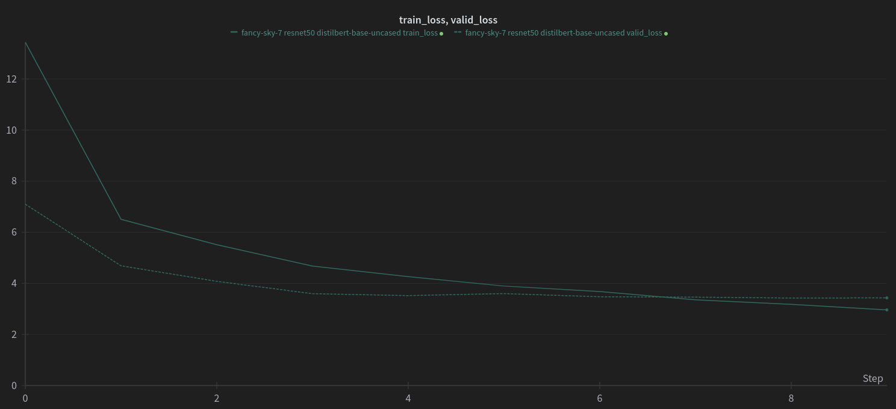

# clip
A PyTorch implementation of [Learning Transferable Visual Models From Natural Language Supervision](https://arxiv.org/abs/2103.00020)


 
### Installation
```
git clone https://github.com/andregaio/clip.git
cd clip
conda create -n clip python=3.8
conda activate clip
pip install -e .
```
### Models
| Name        | Image encoder |      Text encoder       |
| :---------- |    :------:   |         :------:        |
| clip        |   resnet50    | distilbert-base-uncased |

### Dataset
- [Flickr30K](https://www.kaggle.com/datasets/hsankesara/flickr-image-dataset?select=flickr30k_images)

### Training
```
python clip/train.py
```


### Inference
```
python clip/infer.py
```

### [Results](https://wandb.ai/andregaio/clip)
<div align="center">





</div>

### Notes
 - The code has been heavily borrowed from https://github.com/moein-shariatnia/OpenAI-CLIP